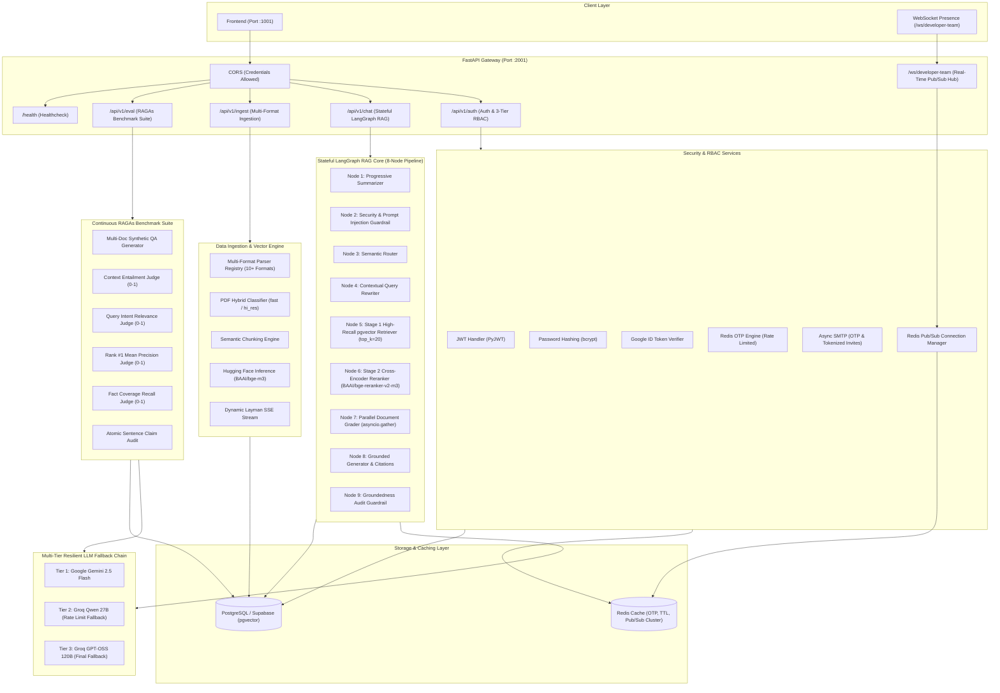

# Noesis - Enterprise Agentic RAG Platform Backend

A high-performance, production-grade backend for **Noesis** — an Agentic Retrieval-Augmented Generation (RAG) platform. Built with **FastAPI**, **LangGraph**, **PostgreSQL (Supabase pgvector)**, **Redis**, and a multi-format document ingestion and continuous RAGAs evaluation engine.

---

## Architecture Overview



---

## Core Systems & Features

### 1. 3-Tier Role-Based Access Control (RBAC) & Tokenized Invitations

| Role | Badge | Permissions |
| :--- | :--- | :--- |
| **Super Admin** | `👑 Super Admin` | **Root Owner** (`DEVELOPER_EMAILS`). Can invite **Admins & Members**, revoke any team member, and cannot be revoked or demoted by anyone. |
| **Admin** | `🛡️ Admin` | **Team Administrator**. Can invite **Members**, run benchmarks, and revoke Members. Cannot revoke Super Admin or other Admins. |
| **Member** | `💻 Member` | **Developer / Analyst**. Can execute benchmarks, inspect granular claim evaluations, and view scorecards. Cannot invite or revoke team members. |

#### Tokenized Invitation Flow:
1. **Inviting Teammates**: Inviter selects `Member` or `Admin` role in the Developer Team modal.
2. **Secure Token Generation**: Generates a 32-byte URL-safe secret token (`/accept-invite?token=...`) stored with `status="PENDING"`. The user is **NOT** promoted until accepted.
3. **Interactive Acceptance**: Invitee clicks the link to review invitation metadata and clicks **"Accept & Join Team"** to activate developer privileges.
4. **Real-Time Synchronization**: Broadcasts `DEVELOPER_INVITED`, `DEVELOPER_JOINED`, and `DEVELOPER_REVOKED` over WebSockets to sync presence and membership across all open browser sessions without refreshing.

---

### 2. Multi-Tier Resilient LLM Fallback Chain
* **Environment-Driven Configuration**: All LLM models are configured in `.env` via `GEMINI_MODEL_NAME`, `GROQ_MODEL_NAME`, and `GROQ_FALLBACK_MODEL_NAME`. Zero hardcoded model names.
* **3-Tier Automatic Failover**:
  * **Tier 1**: Google Gemini (`gemini-2.5-flash`) — Ultra-low latency primary model.
  * **Tier 2**: Groq Qwen (`qwen/qwen3.8-27b`) — High-speed fallback on rate limits or API outages.
  * **Tier 3**: Groq GPT-OSS (`openai/gpt-oss-120b`) — Massive parameter secondary fallback ensuring 100% uptime.

---

### 3. Continuous RAGAs Automated Quality Benchmark Suite
* **Synthetic QA Synthesis**: Generates diverse, document-grounded evaluation questions and synthetic ground truth answers across indexed vector stores.
* **5-Dimensional Quality Scorecard**:
  * **Overall RAG Score**: Composite weighted score of context entailment, relevance, precision, and recall.
  * **Faithfulness (0–100%)**: Verifies zero hallucinations by ensuring all generated statements are strictly entailed by retrieved context chunks.
  * **Answer Relevance (0–100%)**: Measures how directly and concisely the answer addresses the user query.
  * **Context Precision (0–100%)**: Evaluates whether the most relevant document chunks are ranked at the top (Rank #1).
  * **Context Recall (0–100%)**: Measures fact coverage against synthetic reference ground truths.
* **Atomic Claim Verification Audit**: Breaks every generated answer into individual atomic sentences and audits each for context groundedness with granular reasoning.

---

### 4. Stateful LangGraph RAG Agent (8-Node Pipeline)
* **Progressive History Summarization**: Incrementally condenses extended conversation history to maintain contextual memory without exceeding token ceilings.
* **Security & Prompt Injection Guardrail**: Sanitizes inputs and rejects adversarial prompt injection attempts.
* **Semantic Intent Router**: Intelligently routes queries between vector search, direct synthesis, or clarification flows.
* **Contextual Query Rewriting**: Resolves pronouns, co-references, and missing context before vector retrieval.
* **Stage 1 Vector Retrieval**: Queries pgvector embeddings (`BAAI/bge-m3`) with top-k recall.
* **Stage 2 Cross-Encoder Reranker**: Rescores retrieved passages with `BAAI/bge-reranker-v2-m3` to eliminate irrelevant noise.
* **Parallel Document Grader**: Concurrently verifies chunk relevance using `asyncio.gather`.
* **Grounded Answer Generator & Inline Citations**: Synthesizes verified answers with page-level citations.

---

### 5. Multi-Format Data Ingestion Engine
* **10+ Supported File Formats**: PDF, Markdown, DOCX, CSV, TSV, Excel (`.xlsx`, `.xls`), HTML, JSON, PPTX, XML, and TXT via `ParserRegistry`.
* **Dynamic Layman SSE Stream (`POST /api/v1/ingest/stream`)**: Calculates and streams genuine ingestion progress in real time (e.g. *"Teaching AI concepts (16 of 42 sections learned)..."*).
* **Hybrid PDF OCR**: Dynamically switches between `pdfplumber` fast text parsing and `unstructured` OCR table extraction.

---

## API Endpoints

### Authentication & RBAC (`/api/v1/auth`)
| Method | Endpoint | Description | Auth Required |
| :--- | :--- | :--- | :--- |
| `POST` | `/api/v1/auth/signup` | Register new account and send 6-digit OTP | Public |
| `POST` | `/api/v1/auth/verify-otp` | Verify OTP and set HttpOnly session cookie | Public |
| `POST` | `/api/v1/auth/resend-otp` | Resend verification OTP (rate limited) | Public |
| `POST` | `/api/v1/auth/login` | Email/password login | Public |
| `POST` | `/api/v1/auth/google` | Google OAuth2 ID token authentication | Public |
| `POST` | `/api/v1/auth/logout` | Clear session cookie | Authenticated |
| `GET` | `/api/v1/auth/me` | Fetch active user profile and developer role | Authenticated |
| `GET` | `/api/v1/auth/developers` | List active developers and pending invitations | Developer |
| `POST` | `/api/v1/auth/invite-developer` | Send tokenized invitation email with role | Admin / Super Admin |
| `GET` | `/api/v1/auth/verify-invite` | Verify invitation token | Public |
| `POST` | `/api/v1/auth/accept-invite` | Accept invitation and activate developer role | Authenticated |
| `POST` | `/api/v1/auth/manage-developer` | Revoke developer access or cancel pending invite | Admin / Super Admin |

### RAG Evaluation Suite (`/api/v1/eval`)
| Method | Endpoint | Description | Auth Required |
| :--- | :--- | :--- | :--- |
| `GET` | `/api/v1/eval/runs` | List historical benchmark runs with scores | Developer |
| `GET` | `/api/v1/eval/runs/{run_id}` | Deep-dive granular test cases & claim audits | Developer |
| `POST` | `/api/v1/eval/runs` | Trigger dynamic multi-document RAG benchmark | Developer |
| `DELETE` | `/api/v1/eval/runs/{run_id}` | Permanently delete evaluation run and test cases | Developer |

### Real-Time WebSockets (`/ws`)
| Protocol | Endpoint | Description | Auth Required |
| :--- | :--- | :--- | :--- |
| `WS` | `/ws/developer-team` | Real-time presence, invitation, and team sync hub | Developer (Cookie/JWT) |

### Chat & Ingestion (`/api/v1/chat`, `/api/v1/ingest`)
| Method | Endpoint | Description | Auth Required |
| :--- | :--- | :--- | :--- |
| `POST` | `/api/v1/chat/message` | Send message through LangGraph RAG pipeline | Authenticated |
| `GET` | `/api/v1/chat/sessions` | List user chat sessions | Authenticated |
| `POST` | `/api/v1/ingest/upload` | Upload and ingest document file | Authenticated |
| `POST` | `/api/v1/ingest/stream` | Stream dynamic Layman SSE ingestion progress | Authenticated |
| `GET` | `/api/v1/ingest/documents` | List indexed documents and chunk statistics | Authenticated |
| `DELETE` | `/api/v1/ingest/documents/{id}` | Delete document and vector chunks from pgvector | Authenticated |

---

## Local Setup & Development

### 1. Prerequisites
* **Python 3.10+** (or `uv` package manager)
* **PostgreSQL** with `pgvector` extension enabled (or Supabase instance)
* **Redis** (Local instance or Redis Cloud)

### 2. Installation
```bash
# Clone the repository
git clone https://github.com/ShubhamPrajapati1402/rag_backend.git
cd rag_backend

# Install dependencies with uv (or pip)
uv pip install -r requirements.txt
```

### 3. Environment Configuration
Create a `.env` file based on `.env.example`:
```bash
cp .env.example .env
```
Fill in your API keys for Gemini, Groq, Hugging Face, Supabase, and SMTP.

### 4. Database Initialization & Run
```bash
# Start FastAPI backend server on port 2001
uv run python -m uvicorn app.main:app --host 0.0.0.0 --port 2001 --reload
```

### 5. Running Tests
```bash
# Execute test suite
uv run pytest
```
